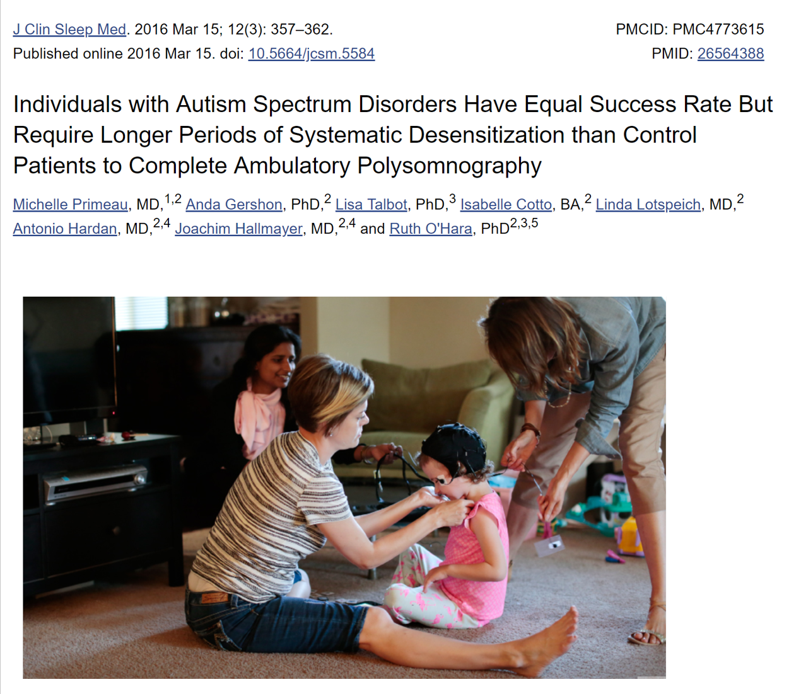

<style type="text/css">
.title {
  display: none;
}

#getting-started img {
  margin-right: 10px;
}

</style>

<div class="row" style="padding-top: 125px;">
<div class="col-sm-12">


## How does someone find out if they have disordered sleep? 

To start, you can check certain things including....

- underlying medical problems like tonsillitis or seizures

- irregular bedtime routines

- food and/or environmental allergies 

(Devnani & Hegde, 2015)


### If sleep is still causing a problem, you may need to be screened for a sleep disorder. 


```{r OGpoly, echo=FALSE,  out.width = '70%'}

```


#### Polysomnographies can be difficult, especially for autistics. They typically require a person to sleep in a lab while connected to a lot of sensors, mostly on their head. 


#### This is what a polysomnography may look like. 

```{r polydiagram, echo=FALSE,  out.width = '80%'}
knitr::include_graphics("polysomnogram_diagram.png")
```


________________________________________________________________________
________________________________________________________________________
________________________________________________________________________


###  Recently, researchers have developed a way to do polysomnographies at home. They designed a protocol specfically for people on the spectrum. 


```{r poly, echo=FALSE,  out.width = '75%'}

```


## What treatments are there for sleep problems? 

To start, it is good to establish consistent bedtime routines. This can help "sleep train" children or adolescents and is particularly helpful for parents. Basically, caregivers complete the bedtime routine and, if their child does not fall asleep, go back to check on them, but only for short periods of time. During these check-ins, parents should be gentle but firm and reiterate the fact that it is bedtime. Things may get worse before they get better, but with time parents should be able to gradually distance themselves from this routine. 


More involved interventions include medications such as benzodiazepines and diphenhydramine. Your doctor should be consulted before taking medication. 


Specific sleep disorders also have specific treatments. For example, a CPAP machine can help people with sleep disordered breathing. 
