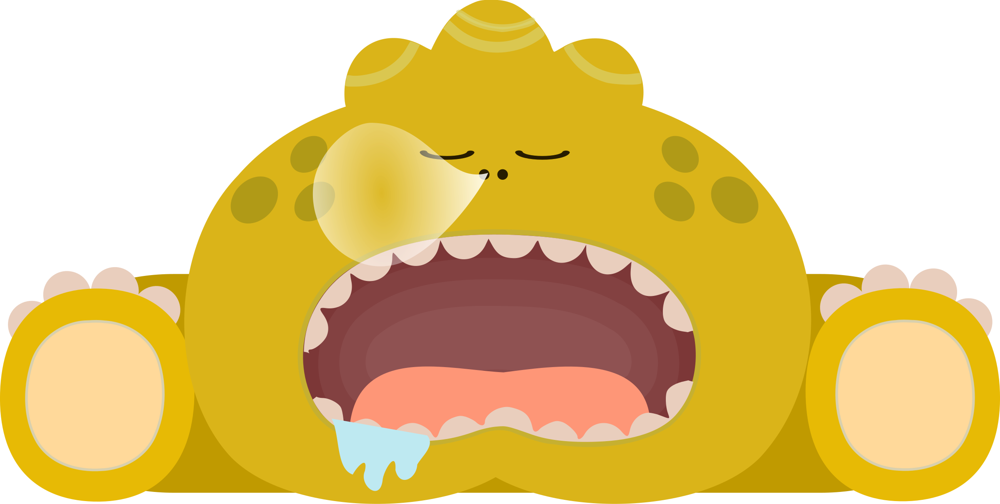

<style type="text/css">
.title {
  display: none;
}

#getting-started img {
  margin-right: 10px;
}

</style>

<div class="row" style="padding-top: 100px;">
<div class="col-sm-12">


# **Sleep and Autism Spectrum Disorder **


## **Getting started**

Sleep is important for our physical, mental, and emotional wellbeing. It may look easy, but sleep can be a major issue for people. Some people struggle with falling asleep, others feel sleepy all the time. 

Sleep can be even more complicated for autistics. As many as 80% of individuals on the spectrum have sleep problems (Cohen et al., 2014). This website hopes to help with that. It is written for autistics, parents or caregivers, and anyone else who may be interested. It outlines sleep disruptions and disorders, highlights video testimonial of autistics experience with sleep, and offers options for diagnosis and treatment.

```{r alien, echo=FALSE,  out.width = '100%'}

```


</div>

